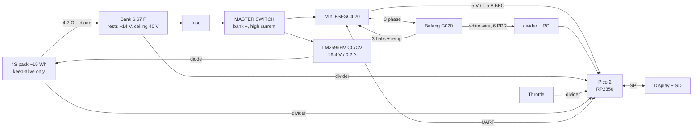

# ReGenX v2 — hardware design

Component stack, pin map, conditioning circuits, communication and power.

**Scope: hardware only.** No control law, no firmware. The regen strategy is what
the simulator and scoring work exist to determine; nothing here presumes it,
beyond making sure the sensing and command paths do not preclude any reasonable
strategy.

---

## 1. Component stack

### Core

> **Superseded sections.** §8.3 (contactor and its drive) and every reference to a
> contactor, a coil driver, or a separate Pico buck describe an architecture that
> was deleted. `power-architecture.md` and drawing RGX-2-100 Rev B are the current
> source of truth for the power path. Where this file and the drawing disagree,
> **the drawing wins.**

| | Part | Why |
|---|---|---|
| MCU | **Raspberry Pi Pico (RP2040)** | PIO does speed capture in hardware. RP2350 was specified earlier and dropped on cost — nine pins and one capture do not need it |
| Motor controller | **Flipsky Mini FSESC4.20** | 8–60 V, 50 A/150 A, owned. 8 V floor is equal-best across the VESC family |
| Motor | **Bafang G020** rear | Single-stage ~5:1, hall sensors + 6 PPR shell sensor |
| Bank | **3 × GDCPH 16 V 20 F** series = 6.67 F | Owned. Ceiling 40 V |
| Pack | **4S Li-ion, ~15 Wh** | 13.5–16.8 V usable |

### Interface ICs — **none required**

An earlier revision specified three. Two were unnecessary and the third is
deferred until measurement justifies it.

| Was | Verdict |
|---|---|
| 74LVC14 Schmitt buffer | **Deleted.** RP2350 pads have **built-in Schmitt triggers**, enabled by default. Resistor dividers do the level shift, an RC does the filtering |
| 74HC4051 analog mux | **Conditional** — only if per-module bank sensing is kept. See §5 |
| MAX3490 RS-422 | **Deferred.** The one thing the Pico genuinely cannot do, but the need is now measurable rather than assumed. See §6 |

Remaining active parts:

| Function | Part |
|---|---|
| Pack trickle charger | **LM2596HV CC/CV module**, 5–57 V in, set **17.2 V** / 0.2 A → 16.4 V at the pack after D2. Gates on above **19.2 V** bank |
| Signal conditioning | resistor dividers + RC. Passives only |

> **Deleted:** the contactor, its coil-driver MOSFET, the high-side switch and gate
> driver proposed to replace it, and the Pico's 8–40 V buck.
>
> The master switch cuts bank→VESC directly, so nothing needs switching
> electronically. And the **Mini FSESC4.20 has a 5 V / 1.5 A BEC** — ~7× the Pico's
> ~200 mA need — so the Pico's supply comes from the VESC and needs no converter of
> its own. It also then shares the VESC's ground reference, which is what the
> shell sensor is referenced to.
>
> **One $5 charger module is the entire added active-part count.**

### Power parts

| Function | Spec |
|---|---|
| 5 V rail | **A1's 5 V / 1.5 A BEC.** No converter. Hold-up is C4 100 µF + C5 100 nF + L1 = **4 ms**, decoupling only |
| 3.3 V rail | Pico onboard regulator, fed 5 V into VSYS |
| Precharge resistor **R1** | **4.7 Ω, 50 W** wirewound alu-clad, **heatsunk or chassis-bonded**. Range 4.7–8 Ω: below, fault current; above, supply collapse |
| Thermal cutout **S2** | NC bimetal, 100–110 °C, ≥5 A, **bonded to R1**. Covers the sustained-fault case that no fuse can discriminate |
| Blocking diode **D1** | **≥100 V, ≥6 A generic silicon** (e.g. 6A10). **Not Schottky** — leakage is continuous. **Ultrafast not required** — it carries a 90 s DC precharge, then blocks. 3 A parts run past the junction limit at 3.36 A |
| Charger output diode **D2** | ≥100 V, ≥1 A (1N4007). Returns between F3 and R1 |
| Master switch **S1** | SPST, ≥100 A continuous, **≥60 V DC break**. Make current ~148 A |
| Bank bleed | **Not fitted.** Owner decision. See `power-architecture.md` §9 for the service procedure this obliges |

---

## 2. Block diagram



Everything downstream of the master switch is dead when it is open. The pack is
never switched — it holds the bank at ~14 V through the resistor and diode, which
is why there is no precharge sequence.

---

## 3. RP2350 pin map

| GPIO | Function | Direction | Notes |
|---|---|---|---|
| GP0 | UART0 TX → RS-422 DI | out | |
| GP1 | UART0 RX ← RS-422 RO | in | |
| GP2 | SPI0 SCK | out | shared: display + SD |
| GP3 | SPI0 MOSI | out | |
| GP4 | SPI0 MISO | in | SD only |
| GP5 | Display CS | out | |
| GP6 | Display DC | out | |
| GP7 | Display RST | out | |
| GP8 | SD CS | out | |
| GP9 | Status LED | out | |
| GP10 | *(spare — hall tap, if telemetry rpm proves too slow)* | in | footprint only |
| GP11 | spare | | |
| GP12 | spare | | |
| GP13 | **Shell speed (6 PPR), white wire** | in | **PIO** — the only motor signal we read |
| GP14 | Mux select A | out | |
| GP15 | Mux select B | out | |
| GP16 | Mux select C | out | |
| GP17 | spare | | *(was contactor drive — deleted)* |
| GP18–25 | spare | | reserved for CAN (MCP2515 CS + INT) if adopted |
| **GP26** | **ADC0 ← mux output** | in | |
| GP27 | ADC1 spare | in | |
| GP28 | ADC2 spare | in | |

19 of 26 GPIO used. SPI0 on GP2/3/4 and UART0 on GP0/1 are valid hardware
mappings.

---

## 4. Speed sensing — one wire to the Pico

### Division of labour

**The VESC takes all three motor halls, as designed.** Its connector is a 6-pin
JST PH (PHR-6): `+5 V, GND, H1, H2, H3, TEMP`. The motor plugs in normally — no
tap, no Y-pigtail, no dividers, no breakout on that bundle.

The VESC then reports **ERPM** in `GET_VALUES` / `GET_VALUES_SELECTIVE`, and over
CAN in `CAN_PACKET_STATUS`, broadcast at a configurable rate. Mechanical rpm is
ERPM ÷ pole pairs.

**The white shell-speed wire is not part of that connector.** The VESC has no
input for it; it is a sixth motor wire that otherwise goes nowhere. So it is ours
by default, with nothing to share and nothing to disturb.

The spare 6th pin is a **temperature input** — if the G020 carries a thermistor it
goes to the VESC, not into our analog budget.

| Speed | Source | Path |
|---|---|---|
| **Motor** | 3 halls → VESC | computed by VESC, arrives over the link |
| **Wheel** | white wire, 6 PPR | **direct to Pico, GP13** |

**One signal needs conditioning. Two resistors and a cap.**

> **Superseded.** Earlier revisions specified tapping all four motor signals in
> parallel with the VESC, with dividers and a breakout pigtail. Unnecessary — the
> VESC already reads the halls and already computes speed. Only the shell sensor
> was ever ours.

### The trade this makes

Motor speed now arrives **over the link**, which means link rate and latency sit
inside the slip calculation, and the two speeds are on different timebases.

Two reasons to accept that:

- **Slip needs rpm, not d(rpm)/dt.** v1 added a LispBM `get-rpm-fast` because
  standard telemetry was too filtered to *differentiate*. Differentiation is what
  amplified lag and noise there. Plain rpm is far less demanding.
- **The shell sensor is the bottleneck anyway** at 6 PPR / 20 Hz. Motor speed
  arriving at 50–200 Hz is not the limiting term.

**To measure, not assume:** how heavily VESC-reported ERPM is filtered, and its
effective latency. If it proves too slow, the fallback is tapping a single hall —
one signal, three passives, one GPIO. Leave the footprint on the board.

### Wheel-speed signal

The motor's sensor bundle carries, on typical Bafang colours (**verify on the
actual harness**):

| Wire | Goes to | What it is |
|---|---|---|
| red | VESC | +5 V sensor supply |
| black | VESC | sensor return |
| yellow / green / blue | VESC | Hall A / B / C — rotor position, for commutation |
| **white** | **Pico GP13** | **Shell speed** — Honeywell SS43F reading 6 magnets in the hub case |
| (thermistor, if fitted) | VESC pin 6 | motor temperature |

The white wire reads magnets in the **shell**, not the rotor, which is why it
keeps working while coasting when the halls read zero. That property is the whole
reason the manufacturer fitted it, and the whole reason we want it.

Slip is the difference between the two speeds:
`ω_carrier = (k·ω_wheel − ω_motor)/(1+k)`.

### Two things the earlier revision got wrong

**Nothing pulls this line up.** The SS43F is an **open-collector** output — it sinks
to ground when active and floats otherwise. Normally the controller provides the
pull-up, but the VESC has no input for this wire, so as previously drawn GP13 would
float half the time and read noise.

**And an open-collector output does not care what rail it is pulled to.** Pull it
to **3.3 V** and the level-shifting divider is unnecessary:

```
white wire ──┬──[10 kΩ]── 3.3 V
             ├──[1 kΩ]──┬── GP13
             │          └──[10 nF]── GND
```

Fewer parts and correct. Hysteresis comes from the Pico's pads, which have
Schmitt-trigger inputs enabled by default. The 1 kΩ + 10 nF gives ~10 µs (drawing Rev E; was 1 nF / 1 µs), ample
against a signal topping out near 20 Hz.

### An adapter harness is required

The motor bundle is six wires. The VESC connector is six pins:
`+5 V, GND, H1, H2, H3, TEMP`. Mate them directly and **the speed signal lands on
the VESC's temperature input**, which will read it as a thermistor and report
nonsense or fault.

So the harness must route **five wires through to the VESC** (TEMP left
unconnected) and **branch the white wire** to our board. An earlier revision
claimed no breakout was needed — wrong.

Mitigating: a Bafang connector will not mate with a JST-PH natively anyway, so an
adapter is required regardless. This only adds a branch.

The sensor's +5 V comes from the VESC's supply, so the signal is live only when
the master switch is closed. Fine — wheel speed is not needed before then.

**Measurement method: period, not frequency.** Time between edges gives resolution
that improves at low speed, which is where braking ends. One PIO state machine
timestamps edges in hardware.

Three resistors and a cap per signal. No IC.

- **Level shift.** Halls are pulled to 5 V by the controller and **RP2350 is not
  5 V tolerant**, so a divider is required. 47 k/82 k gives 0.636 ratio → 3.2 V.
  High enough impedance (129 kΩ) that it barely loads the controller's pull-up:
  against a typical 10 k pull-up the node still sits at ~4.6 V, so the MCU sees
  ~2.95 V — comfortably above V_IH.
- **Hysteresis is already in the Pico.** RP2040/RP2350 GPIO pads contain
  **Schmitt trigger input buffers, enabled by default**. That was the 74LVC14's
  main job and the chip already does it.
- **RC filter.** ~64 kΩ source (R1‖R2) with 1 nF ≈ 64 µs — plenty of margin
  against signals topping out in the low kHz, and it kills fast EMI spikes.

If a smaller time constant is wanted, drop to 100 pF for ~6 µs.

> **Alternative, even simpler:** a single 10 kΩ series resistor relying on the
> pin's internal ESD clamp to shed the excess 1.7 V (~170 µA). Widely used and
> works, but technically out of spec. The divider is two extra resistors and is
> correct, so use the divider.

### Tap point

Halls are tapped **in parallel** with the controller's own connection. They are
already pulled up and low-impedance, so a second high-impedance reader does not
disturb them.

**Consequence: hall power comes from the controller, so speed signals are live
only when the contactor is closed.** Acceptable — speed is not needed during
precharge. If wheel speed with the controller off is ever wanted, the sensors
would need our own 5 V rail and the controller's supply left disconnected.

### Measurement method

**Period, not frequency.** Time between edges gives resolution that improves at
low speed, which is where braking ends. PIO state machines timestamp edges in
hardware.

| Signal | Edges per wheel revolution |
|---|---|
| Hall phase A | pole pairs × 2 × gear ratio (~80–160, **TBM**) |
| Shell sensor | **6** |

The 6 PPR shell sensor is the resolution floor of the whole system. At 200 rpm
that is 20 Hz — 50 ms between edges. If tighter resolution is ever needed, add
magnets to the side cover during the carrier modification, since it will be open
anyway.

**Open:** confirm whether a thermistor shares the shell-sensor wire on the G020,
as it does on the Shengyi SX. If so it needs separating before the Schmitt input.

---

## 5. Analog subsystem

The Pico gives **three usable ADC channels** (GP26–28; GP29 is tied to the board's
VSYS divider). The mux existed only because an earlier draft wanted six.

### What is actually needed

| Signal | Essential? |
|---|---|
| Throttle | **Yes** |
| Bank total voltage | **Yes** — taper and ceiling |
| Bank node 1, node 2 | Only for **per-module** overvoltage protection |
| Pack voltage | No — the pack has its own BMS. Nice for a fuel gauge |
| Brake lever | Optional |

Bank total is node 3, so three dividers give *both* per-module voltages and the
total. The real question is whether per-module sensing is kept.

### Two configurations

**A — no mux (3 channels, passives only)**

| ADC | Signal | Divider |
|---|---|---|
| GP26 | Throttle | 15 k / 22 k → 5 V = 2.97 V |
| GP27 | Bank total | 100 k / 7.87 k → 45 V = 3.28 V |
| GP28 | Brake lever *or* pack voltage | per source |

No mux, no buffer, no ICs. Per-module protection is replaced by a **conservative
ceiling plus a one-time bench measurement** of the three modules' capacitance —
which is on the measurement list anyway, and which decides 40 V vs 38 V.

Cost of this choice: a module degrading in service goes unseen. Mitigated by
re-checking with a multimeter periodically, since the modules are accessible.

**B — with 74HC4051 (6 channels, one IC)**

Adds live per-module protection and pack voltage, at the cost of one IC, three
GPIO for the address lines, and settling time after each address change.

### Recommendation

**Start with A.** Per-module sensing guards against capacitance mismatch, and the
bench measurement tells us directly whether that mismatch exists. If the three
modules come back within ~10 %, a 40 V ceiling already has margin and continuous
sensing is protecting against nothing. If they come back at 20 %, that is an
argument for reconfiguring the bank, not for adding an IC to watch it misbehave.

The mux footprint can be left on the board unpopulated, so B stays available
without committing now.

### Divider notes

**Designed to 45 V full scale, not 40 V**, so the ceiling sits at ~2.9 V with
transient headroom rather than clipping.

100 k / 7.87 k gives ~7.3 kΩ source impedance, inside the RP2350 ADC's ~10 kΩ
guidance. A **100 nF cap at each divider output** acts as a charge reservoir for
ADC sampling. Divider plus cap is ~800 µs, and the bank moves at most ~7 V/s, so
lag is a few mV.

Cost ~420 µA per bank divider — only while the master switch is on, and negligible
against a contactor coil.

---

## 6. Communication

### Start with plain UART and measure

Differential signalling is the one thing the Pico cannot do itself — RS-422 needs
line drivers, full stop. But that does not mean fitting them before knowing they
are needed.

v1 had no link diagnostics at all, which is why "EMI" was a hypothesis rather than
a measurement. v2 has CRC, framing, resync and overflow counters from the start
(see `system-design.md` §8). So:

1. **Build with plain 3.3 V UART**, plus the physical-layer work that costs
   nothing: shielded twisted pair, star ground, RC on entry, harness routed away
   from phase wires, and a **lower baud rate** — 19 200 has ~6× the noise margin
   per bit of 115 200, and the payload is tiny.
2. **Ride it and read the counters.**
3. Fit transceivers **only if the error rate justifies them.**

Much of v1's corruption is now attributed to firmware — an unsized RX buffer, a
70 ms blocking LCD re-init, synchronous flash writes, and an O(n²) resync — all of
which are fixed in v2 regardless of the physical layer. It is entirely possible
plain UART is fine once those are gone.

Leave the transceiver footprints on the board unpopulated so the upgrade is a
solder job, not a redesign.

### If the counters say otherwise: RS-422 differential

Fixes it at the physical layer with **no protocol change** — the same VESC frames,
the same MicroPython UART.

```
Pico GP0 ──DI┐                    ┌RO── VESC RX
             │ MAX3490 ══ pair A ══ MAX3490
Pico GP1 ──RO┘        ══ pair B ══        └DI── VESC TX
```

- **MAX3490** is full-duplex — driver and receiver in one 8-pin package, **no
  direction-control pin**, so nothing to get wrong in firmware.
- 3.3 V part at both ends; the Mini FSESC4.20's UART is 3.3 V logic.
- **Two twisted pairs plus a ground reference.** 120 Ω termination at each
  receiver end.
- ±7 V common-mode tolerance covers the ground offset that TTL cannot.

### Alternative: CAN

Better still if available. Two routes:

- **MCP2515 + transceiver over SPI** — MicroPython drivers exist. Costs GP18/GP19
  for CS and INT, and adds SPI latency (~100–200 µs/frame).
- **can2040** (PIO software CAN) — excellent, but it is C and needs a custom
  MicroPython build.

**Open:** whether CAN is broken out on this specific Mini board, or only pads.

---

## 7. Display and storage

Shared SPI0 bus, separate chip selects, **both on core 1** so neither can stall
control.

- Display: SPI, CS/DC/RST on GP5/6/7. **Part still open** — the master-switch
  decision removed the idle-power constraint, so this is now a readability and
  cost choice rather than a power one.
- microSD: SPI, CS on GP8. Writes batched, never in the control path.

---

## 8. Power circuitry

### 8.1 Rails

```
pack 13.5–16.8 V ──[MASTER SWITCH]──┬── buck → 5 V ──┬── Pico VSYS → 3.3 V
                                    │                ├── 74HC4051, 74LVC14
                                    │                └── display, SD
                                    ├── MOSFET → contactor coil
                                    └── 4.7 Ω → diode → bank
```

Pico 2's onboard regulator accepts 5 V on VSYS and makes 3.3 V, so no separate
3.3 V supply is needed.

### 8.2 Precharge

`pack → master switch → 4.7 Ω → diode → bank`. That is the whole circuit — no
converter, no control loop, no disconnect.

Self-terminating: below pack voltage the diode conducts, above it blocks. It also
holds a floor under the bank while riding, so a large boost cannot pull the bus
below the controller's start-up threshold.

- **4.7 Ω, 50 W.** ~3 A peak, ~42 W momentary, ~10 W average over a charge.
- **Silicon ultrafast, not Schottky.** Forward loss is paid for ~60 s per ride;
  reverse leakage is paid continuously and climbs with temperature.
- Pack floor **must** be held at 13.5 V — below that the diode drop puts the
  asymptote under the target and no wait time helps.

### 8.3 Contactor and its drive — **SUPERSEDED, retained for history**

> The contactor was deleted. S1, a mechanical switch in the bank positive, does
> the job with no coil, no driver, and no standby draw. Nothing below is built.
> See `decisions.md`, entry "One switch in the bank positive; contactor deleted".

Normally-open, bank → controller. Drops out by itself when the master switch cuts
coil power, so the controller disconnects without sequencing.

Drive: logic-level N-MOSFET low-side on GP17, **flyback diode across the coil**.

Two selection problems, both real:

- **Coil voltage.** Pack spans 13.5–16.8 V, so a nominal 12 V coil runs hot at the
  top. Either pick a coil rated across that span, regulate 12 V for it, or PWM
  after pull-in.
- **DC breaking.** 40 V DC at up to 50 A does not self-extinguish like AC. If the
  master switch is thrown mid-ride the contactor opens under load. Specify a part
  **rated for DC break at ≥60 V**, not an AC or automotive-12 V relay used out of
  spec. A MOSFET high-side switch avoids arcing entirely at the cost of gate-drive
  complexity and conduction loss.

### 8.4 Service bleed

The bank holds **~5.3 kJ at 40 V with the master switch off** — enough to vaporise
a tool tip across the terminals. The master switch is a *power* switch, not a
service disconnect. Fit a resistor behind a momentary switch or a pulled link,
and label it on the enclosure.

---

## 9a. Protection — the gap

Nothing in earlier revisions specified overcurrent protection. That is an
omission, not a decision.

### Fusing

The bank's own ESR limits fault current more than expected. Cheap 120 F cells run
~10–20 mΩ each, six per module, three modules in series:

```
bank ESR ≈ 180–360 mΩ
fault current at 40 V ≈ 110–220 A
```

Well within an ordinary interrupt rating in *magnitude*. An earlier revision
claimed "thousands of amps," which ignored ESR — that correction stands.

**But magnitude was the wrong test.** ANL and MIDI are **32 V DC** parts. The bank
runs to 40 V and its absolute ceiling is 48.6 V, so no ANL is qualified here at
any amperage, and an earlier note in this file demanding "≥48 V DC" was
unsatisfiable by the part it named. **Class T (160 V DC) is required** — not for
interrupt capacity, for voltage rating.

| Location | Rating | Purpose |
|---|---|---|
| **F1** — bank positive, ahead of S1 | **50 A Class T**, 160 V DC | Fault clearing, protects 10 AWG |
| **F3** — pack positive | **5 A time-delay**, ≥32 V DC | 18 AWG branch protection |
| **F2** — trickle-charger branch | 2 A slow-blow, ≥58 V DC | **Thin-wire protection** |
| Pico 5 V feed | rely on the BEC's own limit | Thin-wire protection |

**50 A, not 60–80.** Two reasons the earlier value was wrong. 10 AWG in a bundled
chassis run wants ≤40 A continuous, so a 60–80 A fuse protects the *fault* but not
the *wire*. And A1's 150 A peak would be permitted by neither — so the **battery
current limit must be set to 40 A in controller configuration** (Sheet 2 Note 4)
and the fuse sized just above it. The fuse then exists only for faults, which is
what a fuse is for.

**F3 must be time-delay, and it is not the whole story.** Precharge draws 3.36 A
for ~90 s. A 3 A fast fuse sits at 112 % of rating — it will eventually
nuisance-blow on a normal cold start, while still failing to clear a real fault.

The deeper problem: **under a sustained bank short the fault current is also
3.36 A.** Identical to normal precharge. *No fuse value can discriminate between
them.* R1 sits at 53 W indefinitely. The failure mode is thermal, so the
protection must be thermal — **S2**, a bimetal cutout bonded to R1. This is why
the pack fuse could not simply be deleted, and why re-rating it was never the fix.

The bank ESR figure has a second consequence: at 40 A roughly **400 W is lost in
the caps themselves**, about 25 % of delivered power at that instant and ~36 %
averaged over a boost. That loss is the dominant term in the boost count — see
`cap-bank-and-precharge.md` §1.

**Why every branch needs its own fuse:** the general rule is **fuse wherever the
gauge steps down** — a 50 A fuse sized for 10 AWG will sit unbothered while a
22 AWG branch burns.

### Wiring and connectors

Not previously specified.

| Run | Gauge | Note |
|---|---|---|
| Bank ↔ fuse ↔ switch ↔ VESC | **10 AWG** | 50 A, keep short |
| Motor phase | as supplied | |
| Pack ↔ resistor ↔ diode ↔ bank | 18 AWG | low current, resistor-limited |
| Signals | 22–24 AWG | twisted where noted |

Bank connections want ring terminals, not push-fit. Anything that can vibrate
loose at 50 A is a fire.

### Transient protection

Long cable runs on a bike pick up transients. Cheap insurance:

- **TVS diode** on the throttle input and the shell-sensor line
- **Bulk capacitance** on the Pico's 5 V feed — ferrite bead + 100 µF + 100 nF.
  This also rides out BEC dips so the Pico does not reset mid-ride
- The RC filters already specified handle high-frequency pickup

### Reverse polarity

The pack is the only user-connected item that could go on backwards. The trickle
module has input reverse protection; nothing else does. **A series diode or a
polarised connector at the pack** — polarised connector is simpler and lossless.

### Pack BMS — cheap board, and not for over-current

A **$3 4S protection board** is enough. The reasons are the two slow failure
modes, not current:

- **Balancing.** Charging at 16.4 V CV is 4.1 V/cell *only if balanced*. About
  0.4 V of total imbalance puts one cell past 4.2 V while the pack total still
  reads correct. That is the failure mode that starts fires.
- **Over-discharge.** The pack sits at a milliwatt drain for months. A cell with
  higher self-discharge can be driven flat while the others look healthy, and a
  deeply discharged Li-ion cell is dangerous on the next charge.

Over-current protection is **not** a driver — the 4.7 Ω already limits the
keep-alive path to ~3 A.

The 13.5 V pack floor is below what a standard board's under-voltage cutoff
enforces (~2.5 V/cell), so that stays a firmware-side warning.

### Charge port

The pack needs a way to be charged externally — for first fill, and for when the
trickle has not kept up. A 4S balance-charge connector, or a barrel jack into the
BMS.

---

## 9b. The remaining circuits

### Throttle

Three wires: **+5 V from the VESC BEC**, GND, signal (~0.8–4.2 V from a hall
throttle).

```
throttle sig ──[15 kΩ]──┬──[22 kΩ]── GND     → 5 V reads 2.97 V
                        ├──[100 nF]── GND
                        ├──[TVS]── GND
                        └── ADC
```

**Add a pulldown** (the 22 kΩ leg does this). Without one, an open circuit leaves
the ADC floating and reading noise.

Fault detection is then free in firmware: a healthy hall throttle idles around
0.8–1.0 V, never 0 V. So **< 0.5 V means open or shorted to ground**, and **> 4.5 V
means shorted to 5 V**. Both outside the valid band, both debounced over N samples
— v1 tripped on single samples, which near motor phases means constant false
trips.

### Brake lever sensor — optional, wire the footprint

Same conditioning as the throttle. Three candidate sources:

| Type | Output | Note |
|---|---|---|
| Hydraulic pressure sensor | 0.5–4.5 V ratiometric | Best signal; needs hydraulic brakes |
| Hall on lever travel | 0.5–4.5 V | Works with any lever |
| Plain switch | digital | Intent only, no proportionality |

Not in the control loop — slip regulation alone gives proportional response. This
is feedforward and intent. Leave the divider footprint and decide later.

### Bank voltage sense — and where its ground goes

```
bank + (post-switch) ──[100 kΩ]──┬──[7.87 kΩ]── GND
                                 ├──[100 nF]── GND
                                 └── ADC        45 V → 3.28 V
```

**The bottom leg must ground at the Pico's ground — which is VESC negative — not
at the bank negative.** Up to 40 A flows in the bank-to-VESC return, and a few
milliohms of cable there is a couple of hundred millivolts of I·R offset. Referenced
to the wrong point, that becomes ~2.7 V of apparent bank-voltage error under load.

Grounding it at VESC negative also means it measures what the VESC actually sees,
which is the number that matters.

### Pack voltage — no divider needed

An earlier revision specified a pack-voltage divider. **Delete it.** Permanently
connected across the pack it would draw ~120 µA ≈ 1.8 mW, roughly doubling the
3 mW standby it was meant to monitor.

Instead: **the bank rests at pack voltage minus one diode drop.** Read bank
voltage once at boot, before any regen, and you have pack health for free from a
divider that already exists.

```
V_pack ≈ V_bank(at boot) + 0.8 V
```

### Link to the VESC

Both ends are 3.3 V logic, so a direct connection — no level shifting.

- 100 Ω series in each line, plus RC as on other signals
- Twisted pair with a ground reference
- Transceiver footprints left unpopulated (see §6)

### Display and SD

Shared SPI0 bus, separate chip selects. Both on **core 1**, so neither can stall
control. SD is 3.3 V native — no level shifting — but wants local bulk
capacitance for write bursts.

**Display recommendation:** this is the last significantly open part, and the
master-switch decision removed the idle-power constraint, so it is now purely a
readability-versus-cost call.

| | Sharp Memory LCD | ST7789 IPS TFT |
|---|---|---|
| Sunlight | **Reflective — better in bright light** | Backlight-dependent, poor in direct sun |
| Colour | Mono | Full |
| Cost | ~$25–40 | ~$6–10 |
| Power | ~10 µW static | 100–300 mW backlight |

**Sharp Memory LCD** is the better fit for a bike you glance at in daylight — it
improves in sun rather than washing out, and the data being shown (voltage, speed,
slip, state) does not need colour. ST7789 is the cheap, available fallback if cost
matters more than legibility.

### Status LED

Pico's onboard LED for heartbeat. An external one on the enclosure is worth it if
the display is not visible while the bike is parked.

### Service bleed

```
bank + ──[momentary switch]──[47 Ω, 50 W]── bank −
```

47 Ω gives τ ≈ 313 s, so roughly 15 minutes to bleed down — slow, but it is a
service tool, not a safety interlock. Initial current 0.85 A, 34 W falling.
**Permanently mounted and labelled**, so it is always to hand rather than a clip
lead someone has to find.

---

## 9. Grounding and EMI

v1's headline failure. Physical-layer work, not firmware.

**Single-point star ground.** Motor power return and signal ground meet at
exactly one point, at the controller's ground terminal. No signal ground path
carries motor current — that is what shifts a hall reference under load.

**Hall tap referencing.** Halls are pulled up to the *controller's* 5 V and
referenced to its ground, so the MCU ground must tie to controller ground at that
same star point. RS-422's ±7 V common-mode range covers what remains.

**Routing.** Sensor and signal harnesses physically separated from the three
phase wires and the bank leads. Hall bundle twisted. RS-422 in twisted pairs, one
per direction.

**Filtering.** RC on every digital signal entry (§4). Ferrite beads on the motor
cable at the controller end. Local decoupling at every IC — 100 nF at each, bulk
at the 5 V rail.

**Bank leads short and fat.** The contactor sits next to the bank so high-current
wiring never leaves the enclosure — the reason a small master switch works at all.

---

## 10. Harness and connectors

| Link | Conductors | Connector |
|---|---|---|
| Motor phase | 3 × heavy | bullet or Anderson |
| Motor sensors | 5 (hall ×3, +5 V, GND) + shell signal | waterproof Julet/HiGo, as supplied |
| Hall tap | 4 signals + GND to the interface board | short pigtail at the controller |
| Bank ↔ contactor ↔ controller | 2 × heavy | ring terminals, short |
| Pack ↔ switch ↔ board | 2 | XT30 or similar |
| MCU ↔ controller | 2 twisted pairs + GND | shielded, shield grounded at one end only |
| Throttle | 3 | as supplied |

---

## 11. Board plan

Enough parts — mux, Schmitt buffer, seven dividers, MOSFET, two transceivers,
buck — that a **small custom PCB** is the right call over perfboard. It also makes
the star ground and the separation of analog from switching a layout decision
rather than a wiring accident.

Suggested partitioning:

- **Interface board**: Pico 2 on headers, 74LVC14, 74HC4051, dividers, RS-422,
  MOSFET driver, SD, display header. Signal-level only.
- **Power block**: contactor, precharge resistor and diode, bleed, bank terminals.
  Separate, heavy, near the bank.

---

## 12. Open part selections

| Item | Decision needed | Blocks |
|---|---|---|
| **Contactor** | DC-break rating and coil voltage (§8.3) | Coil drive design |
| **Display** | Readability vs cost; power no longer constrains | Board header |
| 5 V buck | Module or discrete | Board |
| Brake lever sensor | Hydraulic pressure vs travel hall | Whether ch1 is used |
| CAN | Is it broken out on this Mini board? | Link choice, GP18/19 |
| Thermistor on shell wire? | G020 harness inspection | Conditioning on GP13 |

## 13. Measurements that firm up the design

None block the hardware plan; all set parameters.

1. **G020**: pole pairs, gear ratio by tooth count, kV, phase resistance
2. **Controller start-up voltage** — start-up, not running; hysteresis means the
   two differ and only the higher matters for precharge
3. **Module capacitance**, all three — decides the 40 V ceiling
4. **Bank self-drain**, everything disconnected — settles the balance-board question
