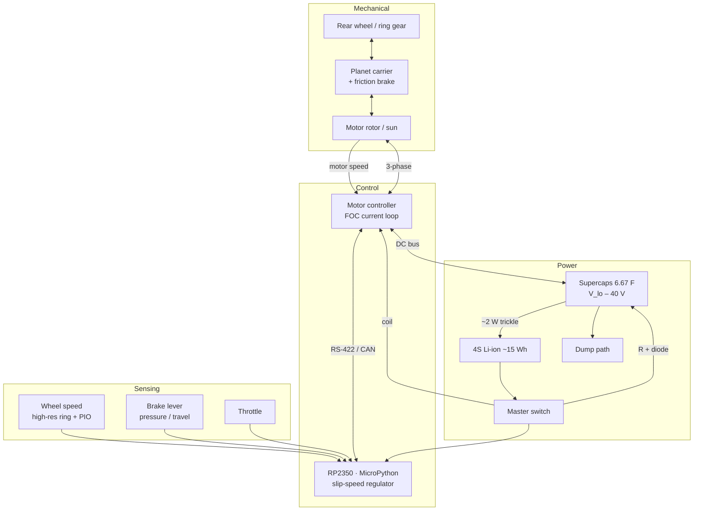

# System overview — v2

Consolidated view of the new design. Scope is v2 only; `firmware/` remains v1 and
untouched.

Status tags: **[locked]** approach settled · **[provisional]** working choice,
could move · **[open]** genuinely undecided.

---

## The concept

A rear geared hub motor with a friction brake on its **planet carrier**. Normally
the carrier freewheels, so the motor is fully decoupled and the bike coasts with
zero drag. Squeeze the brake and the carrier is held, which restores a torque
path from wheel → ring → planets → sun → rotor, and the motor becomes a
generator.

Harvested energy goes into a small supercapacitor bank sized for **a few good
boosts**, not for range.

A small Li-ion pack is fitted, but **not as an electronics rail** — an earlier
revision described it that way and that architecture is gone. Its only job is to
hold the bank above the controller's start-up voltage so the system can boot. The
MCU runs from the controller's own 5 V BEC. See `power-architecture.md`.

---

## Block diagram



---

## Subsystems

### Mechanical **[locked concept, open parts]**

Sun = rotor, ring = wheel shell, carrier = braked member, `k = Z_ring/Z_sun ≈ 4.7`.

Two facts drive everything downstream:

- **Sun and ring counter-rotate.** The rotor turns opposite the wheel in both
  assist and regen. Sign convention must be pinned on the bench first.
- **`T_carrier = −(1+k)·T_sun`.** If the motor produces no torque, the carrier
  brake transmits nothing. No motor torque means *no braking at all* — not weak
  braking.

Requires a **single-stage** planetary. Bafang G310/G311 are out (double-stage).
Shengyi SX1/SX2 is the candidate.

**[open]** Whether a rear hub can present the carrier to a drive-side caliper, or
whether this needs an internal band actuated through the hollow axle. Not
resolvable without opening motors. **This is the largest remaining unknown.**

### Sensing **[locked approach, open resolution]**

Both speeds come from the motor. Slip is the difference between them:

```
ω_carrier = ( k · ω_wheel − ω_motor ) / (1 + k)          magnitudes
```

Carrier locked means `ω_motor = k · ω_wheel` exactly, so the difference is zero.
Any shortfall in motor speed *is* the slip. Nothing else needs measuring.

| Signal | Source | Note |
|---|---|---|
| Motor speed | Motor hall sensors | 11 pole pairs × 6 states × 4.7 gear ≈ 310 edges/wheel-rev. Plenty |
| Wheel speed | Motor's built-in shell speed sensor | Standard feature — see below |
| Brake lever | Pressure or travel sensor | **Optional.** Rider intent / feedforward |
| Throttle | Hall, ADC | Assist demand |

**The wheel sensor already exists as a standard feature.** Most modern geared
hubs ship a separate shell-reading hall on a sixth "white" wire, alongside the
five-wire motor hall bundle — look for an 8-wire motor. Manufacturers added it
for exactly our reason: the freewheel decouples rotor from wheel, so motor halls
read zero while coasting. Requirement satisfied by motor selection, not by an
add-on ring.

**[open] Resolution is the catch.** These built-in sensors are typically
**1 pulse per wheel revolution**. At 200 rpm that is one update every 0.3 s, and
during 0.3 s of hard braking wheel speed can move 20 %. Too coarse for tight slip
control.

Worse, slip is a *difference of two similar large numbers*. At 25 km/h both terms
are ~950 rpm and a 5 % slip is a ~48 rpm gap — so ~1 % accuracy is needed on each
input to resolve it cleanly. Low wheel-speed resolution lands exactly where it
hurts most.

Three ways out, in increasing order of appeal:

1. **Find a motor with a multi-pole shell sensor.** Varies by model; check rather
   than assume.
2. **Add magnets to the side cover.** A known DIY modification, and trivial extra
   work given the carrier is already being opened up.
3. **Sense the carrier directly.** If the carrier's brake surface is accessible,
   a pickup on it gives `ω_carrier` as a *measurement* rather than a derived
   difference — no error amplification, no gear-ratio dependence, no arithmetic.
   Strictly better wherever the geometry allows it, and worth designing toward.

### Control **[locked]**

Carrier slip is **derived, not measured**:

```
ω_carrier = (ω_motor + k · ω_wheel) / (1 + k)
```

The regulator holds `ω_carrier` at a small non-zero setpoint. Because
`P_heat / P_total = s` exactly, **the slip fraction is the loss fraction** — ride
at 5 % slip and 95 % of the braking energy is recovered. A directly measurable
control target with no derivative, no spike detector, no peak-hold.

Braking force is set by the rider *mechanically*: harder lever → more clamp force
→ the regulator must apply more motor torque to hold slip → more braking. The
lever sensor is **feedforward and intent**, not the core loop — it lets the
system respond before slip has developed, and it supplies the `brake_demand`
signal the simulator has always scored against but never been able to measure.

Replaces AIMD, its four tuned parameters, the 1 kHz LispBM peak-hold script, and
the `drpm_mean`/`drpm_peak_neg` plumbing.

### Power **[locked architecture, provisional values]**

**One rail.** An earlier revision of this section described two rails, a
housekeeping supply and a contactor. All three are gone — see
`power-architecture.md` for the current topology and `decisions.md` for why.

**Bank** — 3 × GDCPH 16 V 20 F modules in series = **6.67 F**, 40 V ceiling set by
cell matching rather than cell rating. Delivers **~1.6 boosts at 40 A, ~2.3 at
20 A** once bank ESR is charged for on both counts: it raises the reachable floor
*and* eats energy on the way out.

**Keep-alive pack** — 4S Li-ion ~15 Wh, permanently connected through R1 and D1.
It does **not** power the electronics. Its only job is to hold the bank at ~14 V,
above the controller's 8 V floor, so the system can boot. Trickle-charged from the
bank by U1 above 19.2 V; recovered from flat through the J4 charge port.

**MCU supply** — the controller's own 5 V / 1.5 A BEC. No separate converter.

**Master switch S1** — mechanical, in the bank positive. Open physically
disconnects the controller and the MCU. Off is a true 0 W downstream. No sleep
mode: switch on means running, off means off.

**Precharge** — `pack → F3 → 4.7 Ω → S2 → diode → bank`. That is the entire
circuit. No boost converter, no control loop, no sequencing, **and no disconnect**.

The diode makes it **self-terminating**: caps below pack voltage and it conducts;
caps above and it blocks. Once the bank charges past pack voltage, current stops
on its own. Nothing has to notice or switch anything off.

Two consequences worth having:

- The master switch is *strictly* "pack connected to system." The precharge path
  is just one load on that rail, with no state of its own.
- The same path **holds a floor under the bank while riding**. Drop the caps
  below pack voltage with a big boost and the diode starts conducting again,
  trickling through the resistor. The controller cannot brown out from cap
  voltage falling below its start-up threshold mid-ride. Emergent, and useful.

Silicon, not Schottky — forward loss is paid for one minute per ride, reverse
leakage is paid continuously. Reverse leakage (~5 µA, 0.2 mW) drains caps toward
the pack, negligible against the caps' own self-discharge. **Ordinary rectifier,
not ultrafast:** the diode carries a ~90 s DC precharge and then sits blocking, so
recovery time is irrelevant. What matters is forward current rating — at 3.36 A
and ~1.0 V drop it dissipates 3.4 W, which puts a 3 A axial part past its junction
limit. Hence ≥6 A.

**One protection element cannot be a fuse.** Under a sustained bank short R1 sits
at 53 W drawing 3.36 A — *the same current as a normal cold-start precharge*. No
fuse value separates the two cases. S2, a thermal cutout bonded to R1, covers it.

### Bank full **[deferred]**

**Regen simply tapers off as the bank approaches its ceiling.** That is the whole
behaviour. No dump resistor, no phase-short mode, no handover ladder.

The rider keeps a conventional front brake, which is why this is acceptable on a
rear wheel and why rear was chosen.

Deferred, not dismissed: braking is energy removal, so with a full bank the regen
contribution genuinely goes to zero rather than becoming weak. Revisit only if
riding shows the fade is objectionable.

### Electronics **[provisional]**

| | Choice | Note |
|---|---|---|
| MCU | RP2350 / Pico 2, MicroPython | Dual core, PIO for wheel counting |
| Controller | **Flipsky Mini FSESC4.20** *(locked)* | Already owned. 8 V floor is equal-best across the whole VESC family |
| Link | RS-422 differential, or CAN if broken out | Differential kills the EMI problem at the physical layer |
| Display | **[open]** | See below |
| Logging | microSD over SPI | Off the control path |

**Display is genuinely open again.** Sharp Memory LCD was recommended for its
~10 µW static draw — but the master switch decision removed most idle-power
constraints, since anything downstream of it is zero when off and negligible
against propulsion when on. Memory LCD still wins on sunlight readability
(transflective, no backlight) and pack life, but a bright IPS TFT is viable
again. Choose on merit, not on idle power.

---

## How a ride goes

**Switch on.** MCU boots from the pack. The precharge resistor and diode are
already conducting passively — nothing to command.

**PRECHARGE** — bank below `V_lo`. No regen, no assist. 26–67 s depending on pack
state. MCU watches bank voltage.

**READY** — bank at `V_lo`. Contactor closes, controller boots. Full range is the
rider's, nothing else gating them.

**Riding**
- Throttle → assist current, drawn from the bank
- Brake lever → carrier clamps; slip regulator holds `ω_carrier` at setpoint;
  energy flows into the bank
- Bank approaching 40 V → regen tapers to zero. Front brake covers the rest
- Trickle charger tops up the pack whenever the bus has surplus

**Switch off.** Contactor drops out, everything goes to zero. Caps self-discharge
over the following days, which is what the next precharge is for.

Two states total. That is the whole state machine.

---

## Firmware shape **[locked]**

Target ~800 lines across 6 modules, against v1's ~3 200 across 21. Most of the
reduction is deletion, not compression.

| Module | Job |
|---|---|
| `main.py` | Scheduler, core split. Core 0 is control and nothing else |
| `link.py` | Controller transport — zero-copy ring buffer, table CRC, error counters |
| `sense.py` | Throttle, lever, wheel speed via PIO, debounced validity |
| `control.py` | Slip estimate, slip PI, assist mapping, friction handover |
| `power.py` | Precharge state, contactor, taper, fault debouncing |
| `ui.py` | Display and SD logging — core 1 only, structurally cannot stall control |

Carried over from the v1 review: sized RX buffer, real measured `dt`,
accumulating timers, non-latching overvoltage, per-module voltage sensing, and a
firmware version stamp.

---

## Open items, ranked

1. **Carrier access on a rear hub** — the largest unknown, and it gates the whole
   mechanical design. Needs a motor on the bench.
2. **Controller start-up voltage** — sets `V_lo`, precharge time, and whether the
   pack floor constrains anything.
3. **Module capacitance spread** — decides 40 V vs 38 V ceiling.
4. **Bank self-drain** — settles whether the stock balance boards contributed to
   the original idle problem.
5. Display part, diode part, contactor part, R value.

Items 2–4 are afternoon bench tests needing no new parts.
